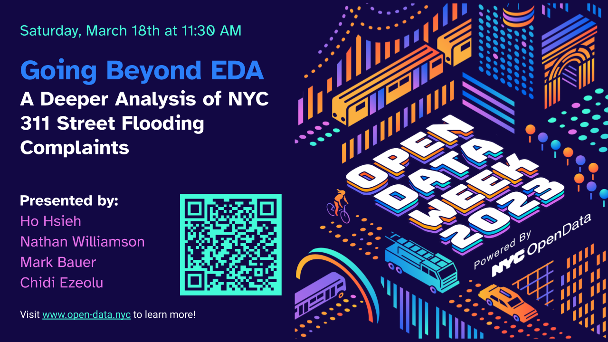
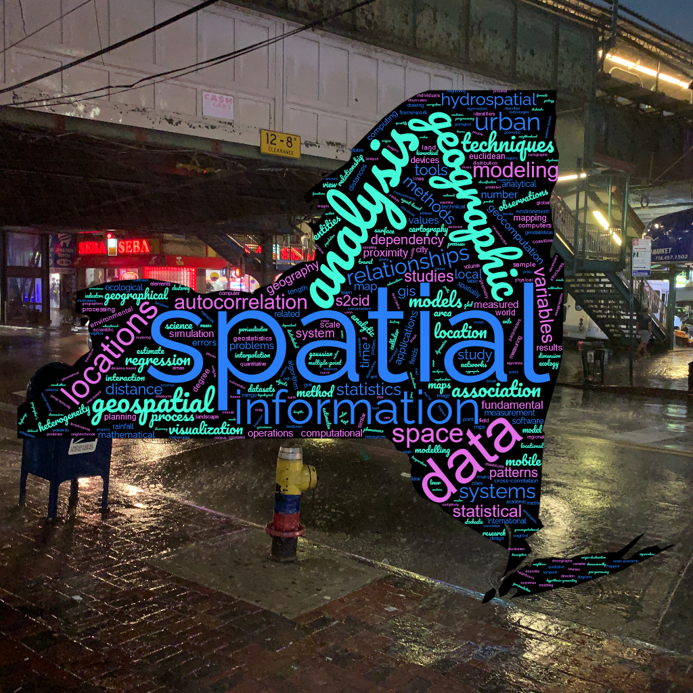
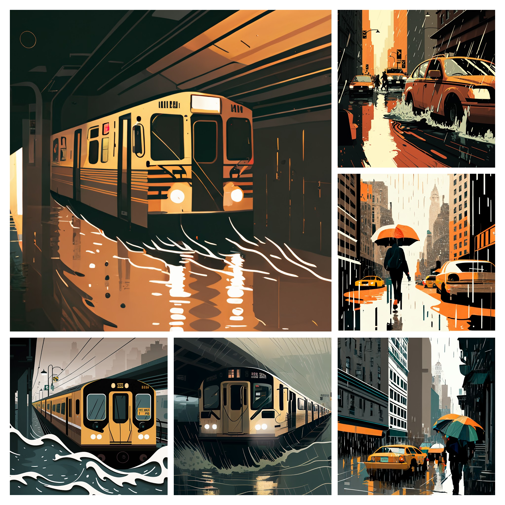

# [NYC Open Data Week 2023](https://www.open-data.nyc/) 📊

[](https://github.com/datalifenyc/nyc-street-flooding-analysis) [](https://mybinder.org/v2/gh/datalifenyc/nyc-street-flooding-analysis/main?labpath=analysis-book%2F)

## When 🗓

````{card} NYC School of Data

Saturday, March 18, 2023
^^^
[Schedule](https://nycsodata23.sched.com/) 🕘 [Session Details](https://nycsodata23.sched.com/event/1JUZQ/going-beyond-eda-a-deeper-analysis-of-nyc-311-street-flooding-complaints) 🎞 <mark >[⭳ Download Presentation Slides](https://github.com/datalifenyc/nyc-street-flooding-analysis/blob/main/analysis-book/slides/NYC-Open-Data-Week-2023_NYC-School-of-Data_Going-Beyond-EDA-NYC-Street-Flooding-Complaints_2023-03-18_FINAL.pdf)</mark>

[](https://github.com/datalifenyc/nyc-street-flooding-analysis/blob/main/analysis-book/slides/NYC-Open-Data-Week-2023_NYC-School-of-Data_Going-Beyond-EDA-NYC-Street-Flooding-Complaints_2023-03-18_FINAL.pdf)
+++
__Organizers:__ [NYC Data Team @ OTI](https://www1.nyc.gov/content/oti/pages/) ✨ [BetaNYC](https://beta.nyc/) ✨ [Data Through Design](https://datathroughdesign.com/)
````

## Description 🌦

- What secrets can we learn about NYC from 311 Street Flooding Complaints❓
- Have you ever considered examining the relationship of NYC 311 Street Complaints dataset to other geospatial datasets❓

__In this talk, we attempt to answer three questions:__

::::{grid}
:gutter: 3

:::{grid-item-card}
_How can we __measure inequality__ in street flooding complaints?_
:::

:::{grid-item-card}
_Is there a relationship between street flooding complaints and __property values__?_
:::

:::{grid-item-card}
_How does street flooding complaints compare to __actual modeled__ flooding data?_
:::
::::

```{admonition} Inspiration!
:class: tip
This project stems from a prior NYC Open Data 2021 talk: [Analyzing NYC's 311 Street Flooding Complaints from 2010 to 2020](https://github.com/mebauer/nyc-311-street-flooding), given by [Mark Bauer](https://github.com/mebauer). This talk is an attempt to address some of the questions that were asked during the Q&A session.
```

## Who should attend? 👩🏽‍💻

Anyone with __beginner-level__ proficiency is welcome! It is helpful, but not required to have some background knowledge in:

✔ Basics of Python or other programming languages (R, SQL, etc.)  
✔ Implementing Data Analysis techniques  
✔ Working with Jupyter Notebooks  
✔ Interest in NYC 311 Open Data or Street Flooding datasets  

## Speakers | Say Hello 👋

A group of civic minded __data enthusiasts__, who enjoy solving City related data problems together.

| Presenter | LinkedIn | GitHub | Twitter |
| --------- | -------- | ------ | ------- |
| Ho Hsieh | [](https://www.linkedin.com/in/hohsieh) | [](https://github.com/hohsieh) | |
| Nathan Williamson | [](https://www.linkedin.com/in/nathan-williamson-b0a15a122) | [](https://github.com/nateswill) | |
| Mark Bauer | [](https://www.linkedin.com/in/markebauer) | [](https://github.com/mebauer) | [](https://twitter.com/markbauerwater) |
| Chidi Ezeolu | [](https://www.linkedin.com/in/chidi-ezeolu-411b0856) | [](https://github.com/datalifenyc)| |

## Agenda 📄

::::{grid}
:gutter: 2

:::{grid-item-card} 1️⃣ Introduction

- Who we are
- Website and GitHub Repo
:::

:::{grid-item-card} 2️⃣ Statement of Objectives

- Brief Overview of Data Science Lifecyle
- Why Beyond EDA?
:::
::::

::::{grid}
:gutter: 2

:::{grid-item-card} 3️⃣ Analysis Methods

- Method 1
- Method 2
- Method 3
:::

:::{grid-item-card} 4️⃣ Summary & Conclusions

- References & Resources
- Q & A
:::
::::

## Visualizations 🖼



{cite}`ezeolu2023geospatialanalysis,wiki2019spatialanalysis`



{cite}`ezeolu2023nycsubwayfloodcollage`
